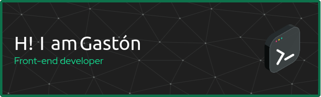

I have been learning to code since 2019, from C# in Unity Engine to Typescript in Angular, where i remain developing my skills. I'm also interested in back-end development and i see it as a way to remain independent on individual projects,so i started to learn NestJS. Dot NET picked my interest too, so why don't give it a shot?

* 🌍  I'm based in Córdoba, Argentina
* 🖥️  See my portfolio at [AeroreHighwind.github.io](http://aerorehighwind.github.io/)
* 🧠  I'm learning NestJS, dotNET, PostgreSQL
* ⚡  Debian is my daily driver, but i dont do any crazy stuff with the terminal nor bash scripting lol

### Skills

### Socials

 <a href="https://discord.com/users/gastongallegos" target="_blank" rel="noreferrer"> <picture> <source media="(prefers-color-scheme: dark)" srcset="undefined" /> <source media="(prefers-color-scheme: light)" srcset="https://raw.githubusercontent.com/danielcranney/readme-generator/main/public/icons/socials/discord.svg" />  </picture> </a> <a href="https://www.github.com/AeroreHighwind" target="_blank" rel="noreferrer"> <picture> <source media="(prefers-color-scheme: dark)" srcset="https://raw.githubusercontent.com/danielcranney/readme-generator/main/public/icons/socials/github-dark.svg" /> <source media="(prefers-color-scheme: light)" srcset="https://raw.githubusercontent.com/danielcranney/readme-generator/main/public/icons/socials/github.svg" />  </picture> </a> <a href="https://www.linkedin.com/in/cesar-gaston-gallegos/" target="_blank" rel="noreferrer"> <picture> <source media="(prefers-color-scheme: dark)" srcset="https://raw.githubusercontent.com/danielcranney/readme-generator/main/public/icons/socials/linkedin-dark.svg" /> <source media="(prefers-color-scheme: light)" srcset="https://raw.githubusercontent.com/danielcranney/readme-generator/main/public/icons/socials/linkedin.svg" />  </picture> </a>

### Badges

<b>My GitHub Stats</b>

<b>Top Repositories</b>

       